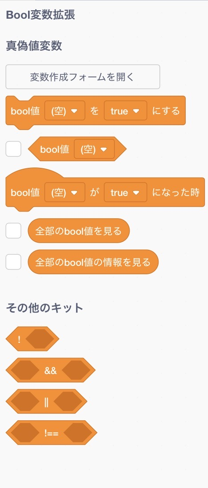

# BoolVariable

## ⚠️ Important Notice
We have identified an issue where installing this extension with "Sandbox" mode enabled may corrupt the block palette. 
**Please follow these steps for a safe installation:**
1. Download the JavaScript file using the icon: 
2. Go to **Extensions** → **TurboWarp** → **Custom Extensions** → **File**.
3. Disable "Sandbox" mode before installing the file.

## Usage
Once installed, the following blocks will be added to the block palette:

The "Boolean Variable" section is the core of this extension.

| Block | Description (Note: "Variables" here are specific to this extension and cannot be accessed by standard Scratch blocks.) |
| :--- | :--- |
| `Open variable creation form` | Opens the form to create a new variable. |
| `Set bool [ ] to [true]` | Sets the value of a specific variable to true/false. |
| `(bool [ ])` | Returns the current value of the variable. |
| `When bool [ ] becomes [true]` | Triggers when the variable changes to the specified value (executes only at the moment of change). |
| `View all bools`, `View all bools info` | [For Debugging] Displays the status of all variables. |

The "Other Kit" section provides utility tools for logical operations:

| Block | Name | Description |
| :--- | :--- | :--- |
| `!` | Not | Inverts the condition. |
| `&&` | And | Returns true if both conditions are true. |
| `\|\|` | Or | Returns true if at least one condition is true. |
| `!==` | Exclusive OR (XOR) | Returns true if only one condition is true. |

*Note: `!==` (XOR) is complex to construct with standard Scratch blocks; this extension provides it as a simplified utility.*

## Copyright &copy; 2026 utakeuchigames
